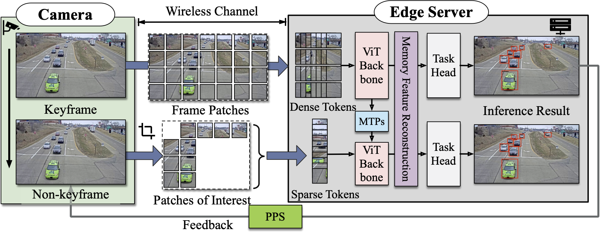
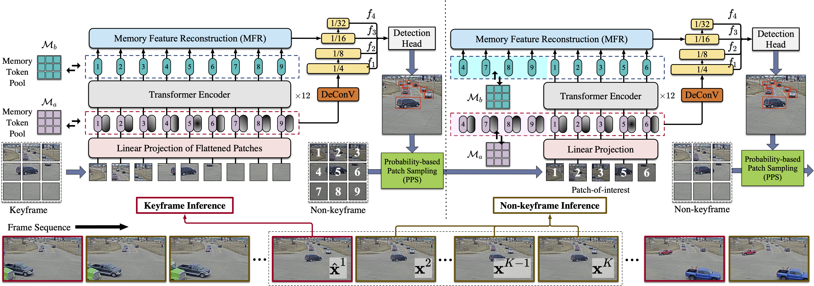
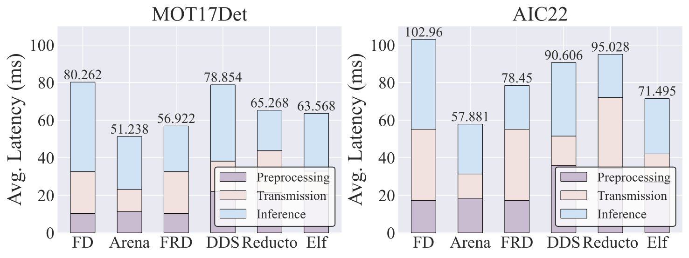
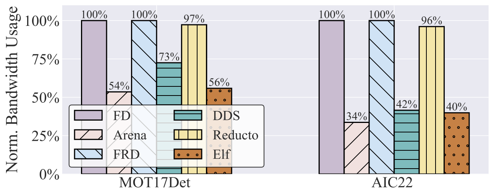
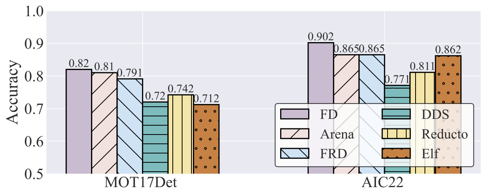

# Arena_pages

This is the repository that contains source code for the [Arena website](https://livioni.github.io/Arena_pages/).



## Abstract

The advent of edge computing has made real-time intelligent video analytics feasible. Previous works, based on traditional model architecture (e.g., CNN, RNN, etc.), employ various strategies to filter out non-region-of-interest content to minimize bandwidth and computation consumption but show inferior performance in adverse environments. Recently, visual foundation models based on transformers have shown great performance in adverse environments due to their amazing generalization capability. However, they require a large amount of computation power, which limits their applications in real-time intelligent video analytics. In this paper, we find visual foundation models like Vision Transformer (ViT) also have a dedicated acceleration mechanism for video analytics. To this end, we introduce Arena, an end-to-end edge-assisted video inference acceleration system based on ViT. We leverage the capability of ViT that can be accelerated through token pruning by only offloading and feeding Patches-of-Interest (PoIs) to the downstream models. Additionally, we employ probability-based patch sampling, which provides a simple but efficient mechanism for determining PoIs where the probable locations of objects are in subsequent frames. Through extensive evaluations on public datasets, our findings reveal that Arena can boost inference speeds by up to $1.58\times$ and $1.82\times$ on average while consuming only 54% and 34% of the bandwidth, respectively, all with high inference accuracy.




## Evaluation

 





## Visualizations


```
@misc{peng2024arena,
      title={Arena: A Patch-of-Interest ViT Inference Acceleration System for Edge-Assisted Video Analytics}, 
      author={Haosong Peng and Wei Feng and Hao Li and Yufeng Zhan and Qihua Zhou and Yuanqing Xia},
      year={2024},
      eprint={2404.09245},
      archivePrefix={arXiv},
      primaryClass={cs.MM}
}
```

# Website License

`<a rel="license" href="http://creativecommons.org/licenses/by-sa/4.0/">``</a><br />`This work is licensed under a `<a rel="license" href="http://creativecommons.org/licenses/by-sa/4.0/">`Creative Commons Attribution-ShareAlike 4.0 International License`</a>`.
